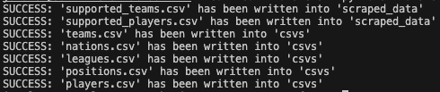

# TransferMarkt Scraper

## Steps to Run the Transfermarkt Scraper

1. **Create a virtual environment and install dependencies**:
   Homebrew-managed Python blocks system-wide package installs, so keep scraper dependencies in a local virtual environment:

   ```bash
   cd transfermarkt_scraper
   python3 -m venv .venv
   source .venv/bin/activate
   python -m pip install -r requirements.txt
   ```

2. **Define user agent**:
   Set up a user agent string to mimic a real browser request. This is necessary to avoid being blocked by the website. Instructions can be found in [`headers.py`](https://github.com/athom031/Dream-Team-Transfers/blob/main/transfermarkt_scraper/constants/headers.py)

3. **Run the script**:
   Execute the main script to start the scraping process:
   ```bash
   python main.py
   ```



## Introduction

This repository is dedicated to scraping data from [Transfermarkt](https://www.transfermarkt.com) to provide a comprehensive database of player, team, and league information. This data will be used to create a virtual marketplace for the European Transfer Market, ensuring the accuracy and realism of player transfers for the configured season.

## Purpose

Transfermarkt is a valuable data source for simulating real-life player, team, and league data. However, since it doesn't offer public APIs, we need to scrape the website to collect the necessary information for our project. This data will later be integrated into the backend to create the virtual marketplace.

## Supported Leagues

To maintain a realistic scope for the website while providing a wide range of player options, we have selected the following leagues as the most relevant markets for player transfers to the Premier League:

- Premier League (British Top Tier)
- Championship (British Second Tier)
- La Liga (Spanish Top Tier)
- Bundesliga (German Top Tier)
- Serie A (Italian Top Tier)
- Liga Portugal (Portuguese Top Tier)
- Eredivisie (Dutch Top Tier)

## Supported Teams

The team list is configured in [`constants/leagues_to_parse.py`](https://github.com/athom031/Dream-Team-Transfers/blob/main/transfermarkt_scraper/constants/leagues_to_parse.py).

By default, the scraper uses `TEAM_SELECTION_MODE = CURRENT_LEAGUE_PAGES`. In this mode it scrapes each supported Transfermarkt league page directly and treats every club on that page as part of that league. Use this when Transfermarkt has already updated the target season's league membership.

If Transfermarkt has not updated the new season yet, switch to `TEAM_SELECTION_MODE = PROJECTED_LEAGUES`. In this mode, edit `PROJECTED_TEAM_OVERRIDES` to manually promote, relegate, keep, or exclude teams while scraping the previous season's league pages.

Set `MEMBERSHIP_SEASON_ID` for the league pages used to discover clubs. Set `SQUAD_SEASON_ID` for the squad pages used to scrape players.

[Supported Team Script](https://github.com/athom031/Dream-Team-Transfers/blob/main/transfermarkt_scraper/scraped_data/scrape_and_get_supported_teams.py)

## Supported Players: Scraping Transfermarkt

With a map of league information that connects to supported teams, we can now scrape Transfermarkt to gather data on all supported players, totaling 6044 individuals.

[Supported Player Script](https://github.com/athom031/Dream-Team-Transfers/blob/main/transfermarkt_scraper/scraped_data/scrape_and_get_supported_players.py)

## Data Formatting and Storage

To simplify database management, we have categorized the collected information and stored it in separate CSV files. Each CSV file contains a unique key to connect data points across different categories.

**CSV Categories**

- Leagues
- Nations
- Players
- Positions
- Teams

## Conclusion

By scraping and organizing data from Transfermarkt, we are one step closer to creating an authentic European Transfer Market experience on our website. This database will serve as a foundation for the virtual marketplace, enhancing user engagement and realism for the configured season.
